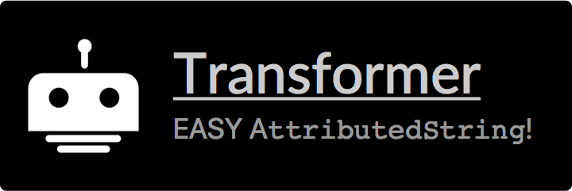
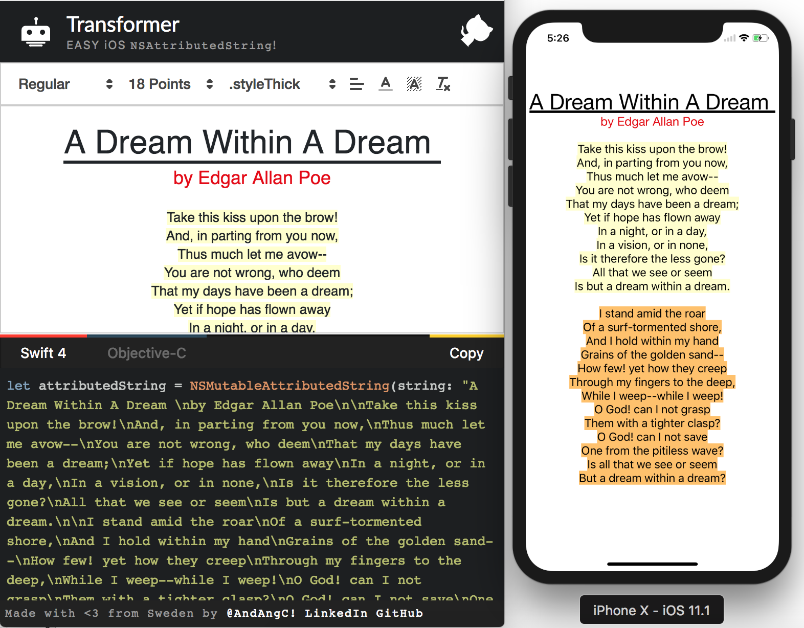

<p align="center">
  
</p>

[](https://travis-ci.org/andresinaka/Transformer)

The main idea of this project is to have an online tool to be able to visually add formatting to a text and get back a `swift` and/or `objective-c` code to reproduce that formating.

[Working App](https://andresinaka.github.io/Transformer/)

Sample
---


Modules
---
- [Quilljs](https://quilljs.com)
- [Highlight.js](https://highlightjs.org/)

To Do
---
Please if you feel like sending a PR you are more than welcome to do it! The way the app is built is pretty simple and if you need some help to get started feel free to get in touch with me! 

- [x] Basic structure and design.
- [ ] Be able to drag and drop custom fonts to be used.
- [ ] Use numbers for text size instead of clases.
- [ ] Optimization of code generated when multiple lines with same format,
- [ ] Keep supporting more formats! Or even for Cocoa?

Usage
---
- Install dependencies:

```
npm install
```

- Start a server listening on localhost:3000 to preview the project:

```
npm start
```
 
- Compile
 
```
npm run-script build
```

- Test
 
```
npm test
```

