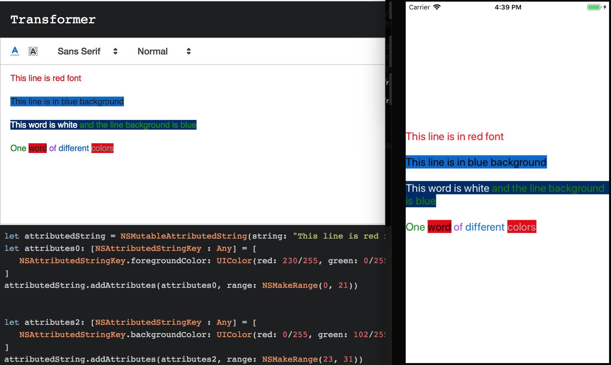
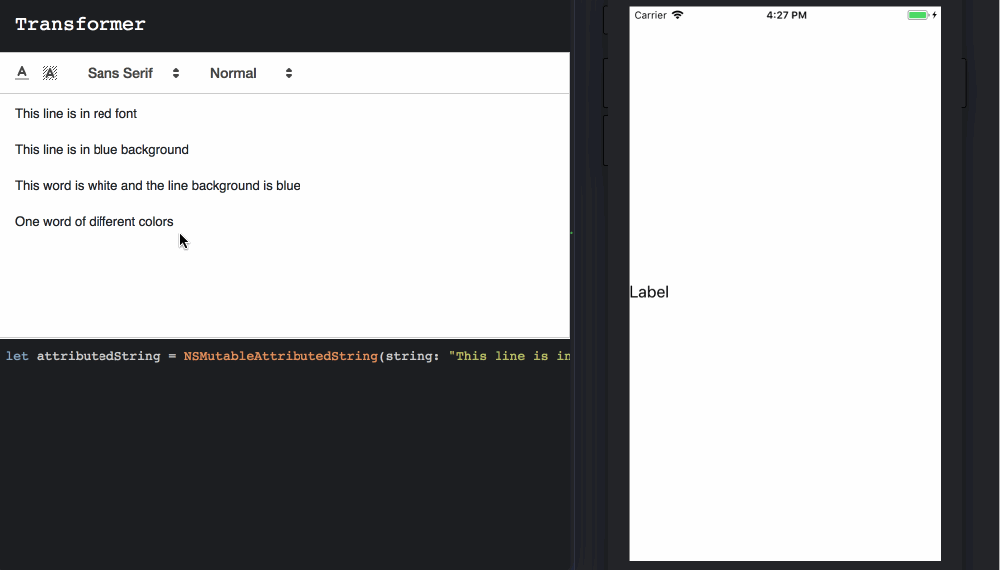

Transformer
---
The main idea of this project is to have an online tool to be able to visually add formatting to a text and get back a swift attributed string with that format.

Modules
---
- [TextEditor](https://quilljs.com)
- [Syntax highlighting for the Web](https://highlightjs.org/)

  
Usage
---
- Install dependencies:

```
npm install
```

- Start a server listening on localhost:3000 to preview the project:

```
npm start
```
 
- Compile
 
```
npm run compile
```

Sample
---




To Do
---

- [x] Basic structure
- [x] Basic design
- [x] Add `NSAttributedStringKey.foregroundColor`
- [x] Add `NSAttributedStringKey.font`
- [x] Add `NSAttributedStringKey.backgroundColor`
- [x] Add button to copy the generated code.
- [ ] Be able to drag and drop custom fonts to be used
- [ ] Use numbers for text size instead of clases
- [ ] Add tests
- [ ] Keep adding support for more `NSAttributedStringKey`
- [ ] Add support for objective-c

